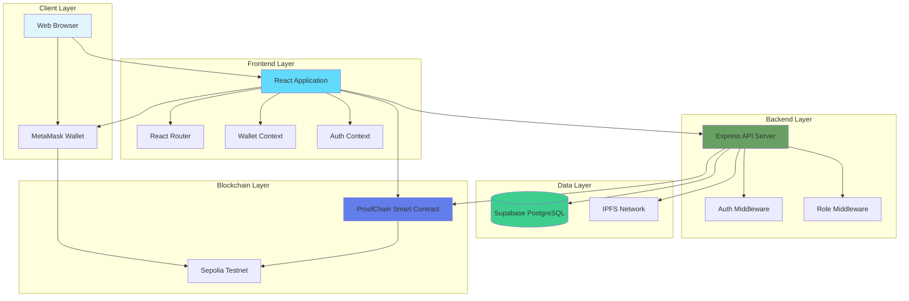

# Design Document - ProofChain Web3 Platform

## Overview

ProofChain is a decentralized document verification platform that combines blockchain immutability, cryptographic hashing, and decentralized storage to create tamper-proof digital credentials. The system enables authorized organizations to issue verifiable credentials while allowing third parties to independently verify document authenticity without relying on centralized intermediaries.

### System Purpose

The platform addresses document forgery and verification challenges in academic certificates, professional credentials, and official documents by creating an immutable audit trail on the Ethereum blockchain. By storing only cryptographic hashes on-chain and maintaining actual document content in IPFS, the system balances transparency with privacy.

### Key Design Principles

1. **Privacy-by-Design**: Store minimal data on-chain (hashes, metadata); keep sensitive content in decentralized storage
2. **Immutability**: Leverage blockchain to create tamper-proof records that cannot be altered retroactively
3. **Decentralization**: Eliminate single points of failure through distributed storage and blockchain consensus
4. **Role-Based Security**: Implement granular access control at database and application layers
5. **Web3 Identity**: Use wallet-based authentication alongside traditional credentials
6. **Public Verifiability**: Allow anyone to verify document authenticity without requiring platform access

### Technology Stack

**Frontend**:
- React 18+ with functional components and hooks
- Vite for fast development and optimized builds
- React Router v6 for client-side routing
- ethers.js v6 for Ethereum blockchain interaction
- Supabase JavaScript client for database and authentication
- qrcode.react for QR code generation

**Backend**:
- Node.js 18+ runtime
- Express.js for REST API
- Supabase client with service role key
- ethers.js for smart contract interaction
- Multer for file upload handling
- IPFS HTTP client for decentralized storage

**Blockchain**:
- Solidity 0.8.x for smart contracts
- Foundry (forge, cast, anvil) for development and testing
- Sepolia testnet for deployment
- OpenZeppelin contracts for security patterns

**Database**:
- Supabase managed PostgreSQL
- Row Level Security (RLS) for authorization
- Automatic timestamp management

**Storage**:
- IPFS for decentralized document storage
- Pinning service (Pinata/Infura) for persistence

## Architecture

### High-Level System Architecture



### Component Interaction Flow

**Document Issuance Flow**:
1. Issuer authenticates (wallet or email)
2. Issuer uploads document file through React UI
3. Frontend calculates SHA-256 hash using Web Crypto API
4. Frontend uploads file to IPFS → receives Content Identifier (CID)
5. Frontend sends issuance request to Express backend
6. Backend validates issuer authorization via Supabase
7. Frontend triggers MetaMask transaction to call smart contract
8. Smart contract validates issuer, stores hash + metadata, emits event
9. Transaction confirmed on Sepolia testnet
10. Backend stores transaction hash and metadata in Supabase
11. Frontend generates QR code with verification URL
12. Success confirmation displayed to issuer

**Verification Flow**:
1. Verifier accesses public /verify route (no authentication)
2. Verifier provides input: file upload OR document ID OR QR scan
3. If file: calculate SHA-256 hash
4. Frontend queries smart contract verifyDocument()
5. Smart contract returns: hash, issuer, owner, timestamp, revocation status
6. If file uploaded: compare calculated hash with on-chain hash
7. Backend logs verification attempt in verification_logs table
8. Display result: VERIFIED / INVALID / REVOKED / NOT_FOUND
9. Show metadata: issuer, owner, issue date, document type

**Authentication Flow (Web3)**:
1. User clicks "Connect Wallet" button
2. Frontend requests wallet connection via MetaMask
3. Backend generates random nonce, stores with wallet address
4. Frontend requests user signature of nonce via MetaMask
5. User signs message with private key (off-chain)
6. Frontend sends wallet address + signature to backend
7. Backend verifies signature using ecrecover
8. Backend creates/updates user record with wallet_address
9. Backend issues JWT session token
10. Frontend stores token, redirects to role-specific dashboard

### Architecture Patterns

**Layered Architecture**:
- **Presentation Layer**: React components and pages
- **Service Layer**: Business logic (blockchainService, ipfsService, authService)
- **API Layer**: Express REST endpoints
- **Data Layer**: Supabase PostgreSQL with RLS
- **Blockchain Layer**: Solidity smart contract on Sepolia

**Security Patterns**:
- **Defense in Depth**: Multiple layers of authorization (frontend routing, backend middleware, database RLS, smart contract modifiers)
- **Principle of Least Privilege**: Each role has minimal necessary permissions
- **Separation of Concerns**: Authentication separate from authorization; frontend validation separate from backend enforcement

**Data Flow Patterns**:
- **Unidirectional Data Flow**: React state flows down, events flow up
- **Event-Driven**: Smart contract events trigger off-chain updates
- **Optimistic UI**: Show pending states during blockchain transactions

## Components and Interfaces

### Frontend Components

#### Core Services

**blockchainService.js**
```javascript
// Wallet and network management
connectWallet() → Promise<string>              // Connect MetaMask, return address
getCurrentAccount() → Promise<string | null>   // Get connected address
getNetwork() → Promise<Network>                // Get current network
switchNetwork(chainId: number) → Promise<void> // Switch to Sepolia (11155111)

// Smart contract interactions
registerDocument(
  hash: string,
  owner: string,
  documentType: string,
  ipfsCid: string
) → Promise<TransactionReceipt>

verifyDocument(
  documentId: number,
  hash: string
) → Promise<VerificationResult>

revokeDocument(documentId: number) → Promise<TransactionReceipt>

getDocument(documentId: number) → Promise<Document>

// Event listening
listenToEvents(callback: (event: ContractEvent) => void) → EventListener
```

**hashService.js**
```javascript
generateSHA256Hash(file: File) → Promise<string>  // Calculate SHA-256 from file
validateHash(hash: string) → boolean               // Validate hash format (0x + 64 hex)
```

**ipfsService.js**
```javascript
uploadFile(file: File) → Promise<string>           // Upload to IPFS, return CID
getFile(cid: string) → Promise<Blob>               // Retrieve file from IPFS
getCID(file: File) → Promise<string>               // Get CID without uploading (precompute)
```

**authService.js**
```javascript
// Traditional authentication
login(email: string, password: string) → Promise<Session>
register(userData: UserRegistration) → Promise<User>
logout() → Promise<void>

// Web3 authentication
requestNonce(walletAddress: string) → Promise<string>
verifySignature(
  walletAddress: string,
  signature: string,
  nonce: string
) → Promise<Session>

getCurrentUser() → Promise<User | null>
```

#### React Context Providers

**AuthContext**
```javascript
{
  user: User | null,
  session: Session | null,
  isAuthenticated: boolean,
  login: (credentials) => Promise<void>,
  logout: () => Promise<void>,
  loading: boolean
}
```

**WalletContext**
```javascript
{
  account: string | null,
  isConnected: boolean,
  network: Network | null,
  connect: () => Promise<void>,
  disconnect: () => void,
  switchToSepolia: () => Promise<void>,
  loading: boolean
}
```

#### Page Components

**Issuer Dashboard Pages**:
- `IssuerDashboard.jsx`: Statistics (issued, active, revoked counts)
- `IssuerDocuments.jsx`: List of issued documents with pagination
- `CreateDocument.jsx`: Document issuance form with file upload
- `DocumentDetail.jsx`: Detailed view with QR code and verification link
- `VerificationHistory.jsx`: List of verification attempts

**Owner Dashboard Pages**:
- `OwnerDashboard.jsx`: List of owned credentials
- `OwnerDocumentDetail.jsx`: View credential details, QR code, share link

**Admin Dashboard Pages**:
- `AdminDashboard.jsx`: System-wide statistics
- `AdminIssuers.jsx`: Manage issuer requests (approve/reject)
- `AdminUsers.jsx`: User management and role assignment
- `AdminDocuments.jsx`: All documents across platform
- `AuditLogs.jsx`: Complete audit trail

**Public Pages**:
- `Landing.jsx`: Platform overview and features
- `Login.jsx`: Email or wallet authentication
- `Register.jsx`: User registration form
- `Verify.jsx`: Public verification interface (file upload, document ID, QR scan)

#### Reusable UI Components

```
Button.jsx         - Styled button with variants (primary, secondary, danger)
Card.jsx           - Container component for content grouping
Input.jsx          - Form input with validation states
Modal.jsx          - Dialog overlay for confirmations
Badge.jsx          - Status indicators (active, revoked, pending)
Table.jsx          - Data table with sorting and pagination
Navbar.jsx         - Top navigation bar
Sidebar.jsx        - Role-specific navigation menu
Toast.jsx          - Notification messages (success, error, warning)
Loader.jsx         - Loading spinner
FileUploader.jsx   - Drag-and-drop file upload
WalletButton.jsx   - MetaMask connection button
QRCode.jsx         - QR code display and download
VerificationStatus - Styled verification result display
TransactionLink.jsx - Etherscan link for transaction hash
```

### Backend API Endpoints

#### Authentication Endpoints

```
POST /api/auth/nonce
Request: { walletAddress: string }
Response: { nonce: string }
Description: Generate nonce for wallet signature

POST /api/auth/verify-signature
Request: { walletAddress: string, signature: string, nonce: string }
Response: { token: string, user: User }
Description: Verify wallet signature and create session

POST /api/auth/login
Request: { email: string, password: string }
Response: { token: string, user: User }
Description: Email/password authentication

POST /api/auth/register
Request: { email: string, password: string, fullName: string, role: string }
Response: { user: User }
Description: Create new user account

POST /api/auth/logout
Request: Headers: { Authorization: "Bearer <token>" }
Response: { success: boolean }
Description: Terminate session
```

#### Document Endpoints

```
POST /api/documents
Auth: Required (Issuer role)
Request: {
  ownerAddress: string,
  documentType: string,
  documentName: string,
  documentHash: string,
  ipfsCid: string,
  recipientName: string,
  description?: string
}
Response: { documentId: number, transactionHash: string }
Description: Create new document record (called after blockchain registration)

GET /api/documents
Auth: Required
Query: { page: number, limit: number, status?: string, type?: string }
Response: { documents: Document[], total: number, page: number }
Description: List documents (filtered by user role)

GET /api/documents/:id
Auth: Required
Response: { document: Document }
Description: Get document details (role-based access)

GET /api/documents/:id/public
Auth: Not required
Response: { document: PublicDocument }
Description: Get public document information for verification

POST /api/documents/:id/verify
Auth: Not required
Request: { documentHash?: string, verifierAddress?: string }
Response: { result: VerificationResult }
Description: Verify document and log attempt

POST /api/documents/:id/revoke
Auth: Required (Issuer or Admin)
Request: { reason?: string }
Response: { success: boolean, transactionHash: string }
Description: Revoke document

GET /api/documents/:id/history
Auth: Required (Issuer or Admin)
Response: { verifications: VerificationLog[] }
Description: Get verification history
```

#### Issuer Endpoints

```
POST /api/issuer/request
Auth: Required
Request: {
  organizationName: string,
  organizationType: string,
  registrationNumber: string,
  walletAddress: string,
  email: string,
  address: string
}
Response: { requestId: number }
Description: Request issuer status

GET /api/issuer/status
Auth: Required
Response: { status: "pending" | "approved" | "rejected", organizationId?: number }
Description: Check issuer approval status

GET /api/issuer/documents
Auth: Required (Issuer role)
Query: { page: number, limit: number, status?: string }
Response: { documents: Document[], total: number }
Description: Get documents issued by authenticated issuer

GET /api/issuer/stats
Auth: Required (Issuer role)
Response: {
  totalIssued: number,
  activeDocuments: number,
  revokedDocuments: number,
  totalVerifications: number
}
Description: Get issuer statistics
```

#### Admin Endpoints

```
GET /api/admin/stats
Auth: Required (Admin role)
Response: {
  totalDocuments: number,
  totalIssuers: number,
  totalVerifications: number,
  pendingRequests: number
}
Description: Get system-wide statistics

GET /api/admin/issuer-requests
Auth: Required (Admin role)
Query: { status?: string, page: number, limit: number }
Response: { requests: IssuerRequest[], total: number }
Description: List issuer requests

PUT /api/admin/issuer-requests/:id
Auth: Required (Admin role)
Request: { action: "approve" | "reject", transactionHash?: string }
Response: { success: boolean }
Description: Approve or reject issuer request

GET /api/admin/users
Auth: Required (Admin role)
Query: { page: number, limit: number, role?: string }
Response: { users: User[], total: number }
Description: List all users

PUT /api/admin/users/:id/role
Auth: Required (Admin role)
Request: { role: "Admin" | "Issuer" | "Owner" | "Verifier" }
Response: { success: boolean }
Description: Update user role

GET /api/admin/documents
Auth: Required (Admin role)
Query: { page: number, limit: number, search?: string }
Response: { documents: Document[], total: number }
Description: List all documents across platform

GET /api/admin/audit-logs
Auth: Required (Admin role)
Query: { page: number, limit: number, action?: string, startDate?: string, endDate?: string }
Response: { logs: AuditLog[], total: number }
Description: Get audit logs with filtering
```

#### Public Endpoints

```
GET /api/verification/:documentId
Auth: Not required
Response: {
  exists: boolean,
  documentHash: string,
  issuer: string,
  owner: string,
  issuedAt: number,
  documentType: string,
  revoked: boolean
}
Description: Public verification endpoint (returns blockchain data)

POST /api/verify/upload
Auth: Not required
Request: multipart/form-data { file: File }
Response: { documentHash: string, matchingDocuments: Document[] }
Description: Verify by file upload, find matching documents
```

### Smart Contract Interface

**ProofChain.sol**

```solidity
// SPDX-License-Identifier: MIT
pragma solidity ^0.8.0;

import "@openzeppelin/contracts/access/Ownable.sol";

contract ProofChain is Ownable {
    
    struct Document {
        uint256 documentId;
        bytes32 documentHash;
        address issuer;
        address owner;
        uint256 issuedAt;
        string documentType;
        string ipfsCid;
        bool revoked;
    }
    
    // State variables
    uint256 private documentCounter;
    mapping(uint256 => Document) public documents;
    mapping(address => bool) public approvedIssuers;
    mapping(bytes32 => uint256[]) private hashToDocumentIds;
    
    // Events
    event DocumentRegistered(
        uint256 indexed documentId,
        bytes32 indexed documentHash,
        address indexed issuer,
        address owner,
        string documentType
    );
    
    event DocumentRevoked(
        uint256 indexed documentId,
        address indexed revoker
    );
    
    event IssuerApproved(address indexed issuer);
    event IssuerRevoked(address indexed issuer);
    
    // Modifiers
    modifier onlyApprovedIssuer() {
        require(approvedIssuers[msg.sender], "Not an approved issuer");
        _;
    }
    
    modifier onlyIssuerOrOwner(uint256 _documentId) {
        require(
            documents[_documentId].issuer == msg.sender || owner() == msg.sender,
            "Not authorized"
        );
        _;
    }
    
    // Constructor
    constructor() {
        approvedIssuers[msg.sender] = true;
    }
    
    // Issuer management functions
    function approveIssuer(address _issuer) external onlyOwner {
        require(_issuer != address(0), "Invalid issuer address");
        require(!approvedIssuers[_issuer], "Issuer already approved");
        
        approvedIssuers[_issuer] = true;
        emit IssuerApproved(_issuer);
    }
    
    function revokeIssuer(address _issuer) external onlyOwner {
        require(approvedIssuers[_issuer], "Issuer not approved");
        
        approvedIssuers[_issuer] = false;
        emit IssuerRevoked(_issuer);
    }
    
    function isIssuerApproved(address _issuer) external view returns (bool) {
        return approvedIssuers[_issuer];
    }
    
    // Document functions
    function registerDocument(
        bytes32 _documentHash,
        address _owner,
        string memory _documentType,
        string memory _ipfsCid
    ) external onlyApprovedIssuer returns (uint256) {
        require(_owner != address(0), "Invalid owner address");
        require(_documentHash != bytes32(0), "Invalid document hash");
        require(bytes(_documentType).length > 0, "Document type required");
        require(bytes(_ipfsCid).length > 0, "IPFS CID required");
        
        documentCounter++;
        uint256 newDocumentId = documentCounter;
        
        documents[newDocumentId] = Document({
            documentId: newDocumentId,
            documentHash: _documentHash,
            issuer: msg.sender,
            owner: _owner,
            issuedAt: block.timestamp,
            documentType: _documentType,
            ipfsCid: _ipfsCid,
            revoked: false
        });
        
        hashToDocumentIds[_documentHash].push(newDocumentId);
        
        emit DocumentRegistered(
            newDocumentId,
            _documentHash,
            msg.sender,
            _owner,
            _documentType
        );
        
        return newDocumentId;
    }
    
    function verifyDocument(uint256 _documentId, bytes32 _documentHash)
        external
        view
        returns (
            bool exists,
            bool hashMatches,
            bool isRevoked,
            address issuer,
            address owner,
            uint256 issuedAt,
            string memory documentType
        )
    {
        Document memory doc = documents[_documentId];
        
        exists = doc.documentId != 0;
        hashMatches = doc.documentHash == _documentHash;
        isRevoked = doc.revoked;
        issuer = doc.issuer;
        owner = doc.owner;
        issuedAt = doc.issuedAt;
        documentType = doc.documentType;
    }
    
    function getDocument(uint256 _documentId)
        external
        view
        returns (Document memory)
    {
        require(documents[_documentId].documentId != 0, "Document does not exist");
        return documents[_documentId];
    }
    
    function revokeDocument(uint256 _documentId)
        external
        onlyIssuerOrOwner(_documentId)
    {
        require(documents[_documentId].documentId != 0, "Document does not exist");
        require(!documents[_documentId].revoked, "Document already revoked");
        
        documents[_documentId].revoked = true;
        
        emit DocumentRevoked(_documentId, msg.sender);
    }
    
    function getDocumentsByHash(bytes32 _documentHash)
        external
        view
        returns (uint256[] memory)
    {
        return hashToDocumentIds[_documentHash];
    }
}
```

## Data Models

### Database Schema (Supabase PostgreSQL)

#### users table
```sql
CREATE TABLE users (
    id UUID PRIMARY KEY DEFAULT gen_random_uuid(),
    wallet_address TEXT UNIQUE,
    email TEXT UNIQUE,
    full_name TEXT NOT NULL,
    role TEXT NOT NULL CHECK (role IN ('Admin', 'Issuer', 'Owner', 'Verifier')),
    organization_id UUID REFERENCES organizations(id),
    created_at TIMESTAMP WITH TIME ZONE DEFAULT NOW(),
    updated_at TIMESTAMP WITH TIME ZONE DEFAULT NOW()
);

CREATE INDEX idx_users_wallet_address ON users(wallet_address);
CREATE INDEX idx_users_email ON users(email);
CREATE INDEX idx_users_role ON users(role);
```

**RLS Policies**:
```sql
-- Admin: full access
CREATE POLICY "Admin full access" ON users
    FOR ALL
    USING (auth.jwt() ->> 'role' = 'Admin');

-- Users can read their own record
CREATE POLICY "Users can read own record" ON users
    FOR SELECT
    USING (auth.uid() = id);

-- Users can update their own record (except role)
CREATE POLICY "Users can update own record" ON users
    FOR UPDATE
    USING (auth.uid() = id)
    WITH CHECK (auth.uid() = id AND role = (SELECT role FROM users WHERE id = auth.uid()));
```

#### organizations table
```sql
CREATE TABLE organizations (
    id UUID PRIMARY KEY DEFAULT gen_random_uuid(),
    name TEXT NOT NULL,
    organization_type TEXT NOT NULL,
    registration_number TEXT,
    wallet_address TEXT UNIQUE NOT NULL,
    email TEXT NOT NULL,
    address TEXT,
    status TEXT NOT NULL DEFAULT 'pending' CHECK (status IN ('pending', 'approved', 'rejected')),
    created_at TIMESTAMP WITH TIME ZONE DEFAULT NOW(),
    updated_at TIMESTAMP WITH TIME ZONE DEFAULT NOW()
);

CREATE INDEX idx_organizations_wallet ON organizations(wallet_address);
CREATE INDEX idx_organizations_status ON organizations(status);
```

**RLS Policies**:
```sql
-- Admin: full access
CREATE POLICY "Admin full access" ON organizations
    FOR ALL
    USING (auth.jwt() ->> 'role' = 'Admin');

-- Issuers can read their own organization
CREATE POLICY "Issuers can read own org" ON organizations
    FOR SELECT
    USING (
        id = (SELECT organization_id FROM users WHERE id = auth.uid())
    );
```

#### documents table
```sql
CREATE TABLE documents (
    id UUID PRIMARY KEY DEFAULT gen_random_uuid(),
    blockchain_document_id INTEGER UNIQUE NOT NULL,
    owner_id UUID NOT NULL REFERENCES users(id),
    issuer_id UUID NOT NULL REFERENCES users(id),
    organization_id UUID REFERENCES organizations(id),
    document_type TEXT NOT NULL,
    document_name TEXT NOT NULL,
    document_hash TEXT NOT NULL,
    ipfs_cid TEXT NOT NULL,
    blockchain_tx_hash TEXT NOT NULL,
    recipient_name TEXT,
    description TEXT,
    issued_at TIMESTAMP WITH TIME ZONE NOT NULL,
    revoked_at TIMESTAMP WITH TIME ZONE,
    status TEXT NOT NULL DEFAULT 'active' CHECK (status IN ('active', 'revoked')),
    created_at TIMESTAMP WITH TIME ZONE DEFAULT NOW(),
    updated_at TIMESTAMP WITH TIME ZONE DEFAULT NOW()
);

CREATE INDEX idx_documents_blockchain_id ON documents(blockchain_document_id);
CREATE INDEX idx_documents_owner ON documents(owner_id);
CREATE INDEX idx_documents_issuer ON documents(issuer_id);
CREATE INDEX idx_documents_organization ON documents(organization_id);
CREATE INDEX idx_documents_status ON documents(status);
CREATE INDEX idx_documents_hash ON documents(document_hash);
```

**RLS Policies**:
```sql
-- Admin: full access
CREATE POLICY "Admin full access" ON documents
    FOR ALL
    USING (auth.jwt() ->> 'role' = 'Admin');

-- Issuers can read documents from their organization
CREATE POLICY "Issuers can read org documents" ON documents
    FOR SELECT
    USING (
        organization_id = (SELECT organization_id FROM users WHERE id = auth.uid())
        AND auth.jwt() ->> 'role' = 'Issuer'
    );

-- Issuers can insert documents for their organization
CREATE POLICY "Issuers can insert documents" ON documents
    FOR INSERT
    WITH CHECK (
        issuer_id = auth.uid()
        AND organization_id = (SELECT organization_id FROM users WHERE id = auth.uid())
        AND auth.jwt() ->> 'role' = 'Issuer'
    );

-- Owners can read their own documents
CREATE POLICY "Owners can read own documents" ON documents
    FOR SELECT
    USING (owner_id = auth.uid());

-- Issuers can update (revoke) their organization's documents
CREATE POLICY "Issuers can revoke org documents" ON documents
    FOR UPDATE
    USING (
        organization_id = (SELECT organization_id FROM users WHERE id = auth.uid())
        AND auth.jwt() ->> 'role' = 'Issuer'
    );
```

#### verification_logs table
```sql
CREATE TABLE verification_logs (
    id UUID PRIMARY KEY DEFAULT gen_random_uuid(),
    document_id UUID NOT NULL REFERENCES documents(id),
    verifier_wallet TEXT,
    verification_method TEXT NOT NULL CHECK (verification_method IN ('document_id', 'file_upload', 'qr_scan')),
    result TEXT NOT NULL CHECK (result IN ('VERIFIED', 'INVALID', 'REVOKED', 'NOT_FOUND')),
    verified_at TIMESTAMP WITH TIME ZONE DEFAULT NOW(),
    ip_address TEXT,
    user_agent TEXT
);

CREATE INDEX idx_verification_logs_document ON verification_logs(document_id);
CREATE INDEX idx_verification_logs_verified_at ON verification_logs(verified_at);
```

**RLS Policies**:
```sql
-- Admin: full access
CREATE POLICY "Admin full access" ON verification_logs
    FOR ALL
    USING (auth.jwt() ->> 'role' = 'Admin');

-- Issuers can read logs for their organization's documents
CREATE POLICY "Issuers can read org document logs" ON verification_logs
    FOR SELECT
    USING (
        document_id IN (
            SELECT id FROM documents 
            WHERE organization_id = (SELECT organization_id FROM users WHERE id = auth.uid())
        )
        AND auth.jwt() ->> 'role' = 'Issuer'
    );

-- Public insert (verification logging doesn't require auth)
CREATE POLICY "Public can insert verification logs" ON verification_logs
    FOR INSERT
    WITH CHECK (true);
```

#### audit_logs table
```sql
CREATE TABLE audit_logs (
    id UUID PRIMARY KEY DEFAULT gen_random_uuid(),
    actor_id UUID REFERENCES users(id),
    action TEXT NOT NULL,
    entity_type TEXT NOT NULL,
    entity_id TEXT NOT NULL,
    transaction_hash TEXT,
    metadata JSONB,
    created_at TIMESTAMP WITH TIME ZONE DEFAULT NOW()
);

CREATE INDEX idx_audit_logs_actor ON audit_logs(actor_id);
CREATE INDEX idx_audit_logs_action ON audit_logs(action);
CREATE INDEX idx_audit_logs_created_at ON audit_logs(created_at);
```

**RLS Policies**:
```sql
-- Admin: full access
CREATE POLICY "Admin full access" ON audit_logs
    FOR ALL
    USING (auth.jwt() ->> 'role' = 'Admin');

-- System can insert audit logs
CREATE POLICY "System can insert audit logs" ON audit_logs
    FOR INSERT
    WITH CHECK (true);

-- Users cannot modify audit logs
-- No UPDATE or DELETE policies
```

#### issuer_requests table
```sql
CREATE TABLE issuer_requests (
    id UUID PRIMARY KEY DEFAULT gen_random_uuid(),
    organization_id UUID REFERENCES organizations(id),
    requested_by UUID NOT NULL REFERENCES users(id),
    wallet_address TEXT NOT NULL,
    status TEXT NOT NULL DEFAULT 'pending' CHECK (status IN ('pending', 'approved', 'rejected')),
    reviewed_by UUID REFERENCES users(id),
    reviewed_at TIMESTAMP WITH TIME ZONE,
    created_at TIMESTAMP WITH TIME ZONE DEFAULT NOW()
);

CREATE INDEX idx_issuer_requests_status ON issuer_requests(status);
CREATE INDEX idx_issuer_requests_organization ON issuer_requests(organization_id);
```

**RLS Policies**:
```sql
-- Admin: full access
CREATE POLICY "Admin full access" ON issuer_requests
    FOR ALL
    USING (auth.jwt() ->> 'role' = 'Admin');

-- Users can read their own request
CREATE POLICY "Users can read own request" ON issuer_requests
    FOR SELECT
    USING (requested_by = auth.uid());

-- Authenticated users can create issuer requests
CREATE POLICY "Authenticated users can create requests" ON issuer_requests
    FOR INSERT
    WITH CHECK (requested_by = auth.uid());
```

### TypeScript Type Definitions

```typescript
// User types
interface User {
  id: string;
  walletAddress: string | null;
  email: string;
  fullName: string;
  role: 'Admin' | 'Issuer' | 'Owner' | 'Verifier';
  organizationId: string | null;
  createdAt: string;
  updatedAt: string;
}

// Organization types
interface Organization {
  id: string;
  name: string;
  organizationType: string;
  registrationNumber: string | null;
  walletAddress: string;
  email: string;
  address: string | null;
  status: 'pending' | 'approved' | 'rejected';
  createdAt: string;
  updatedAt: string;
}

// Document types
interface Document {
  id: string;
  blockchainDocumentId: number;
  ownerId: string;
  issuerId: string;
  organizationId: string | null;
  documentType: string;
  documentName: string;
  documentHash: string;
  ipfsCid: string;
  blockchainTxHash: string;
  recipientName: string | null;
  description: string | null;
  issuedAt: string;
  revokedAt: string | null;
  status: 'active' | 'revoked';
  createdAt: string;
  updatedAt: string;
}

// Verification types
interface VerificationLog {
  id: string;
  documentId: string;
  verifierWallet: string | null;
  verificationMethod: 'document_id' | 'file_upload' | 'qr_scan';
  result: 'VERIFIED' | 'INVALID' | 'REVOKED' | 'NOT_FOUND';
  verifiedAt: string;
  ipAddress: string | null;
  userAgent: string | null;
}

interface VerificationResult {
  exists: boolean;
  hashMatches: boolean;
  isRevoked: boolean;
  issuer: string;
  owner: string;
  issuedAt: number;
  documentType: string;
  result: 'VERIFIED' | 'INVALID' | 'REVOKED' | 'NOT_FOUND';
  reason?: string;
}

// Blockchain types
interface BlockchainDocument {
  documentId: number;
  documentHash: string;
  issuer: string;
  owner: string;
  issuedAt: number;
  documentType: string;
  ipfsCid: string;
  revoked: boolean;
}

// Audit log types
interface AuditLog {
  id: string;
  actorId: string | null;
  action: string;
  entityType: string;
  entityId: string;
  transactionHash: string | null;
  metadata: Record<string, any> | null;
  createdAt: string;
}

// Issuer request types
interface IssuerRequest {
  id: string;
  organizationId: string | null;
  requestedBy: string;
  walletAddress: string;
  status: 'pending' | 'approved' | 'rejected';
  reviewedBy: string | null;
  reviewedAt: string | null;
  createdAt: string;
}
```


## Correctness Properties

*A property is a characteristic or behavior that should hold true across all valid executions of a system—essentially, a formal statement about what the system should do. Properties serve as the bridge between human-readable specifications and machine-verifiable correctness guarantees.*

### Property Reflection

After analyzing all acceptance criteria, the following properties were identified:

**Idempotence Properties**:
- Property 3.6 and 3.9 both test hash calculation idempotence → Can be combined
- Property 7.11 tests verification idempotence → Unique property

**Authorization Properties**:
- Property 2.2 (route authorization) and 2.4 (403 errors) test same concept → Can be combined
- Property 5.7 (issuer authorization) is specific to registration → Keep separate
- Property 6.13 (revocation authorization) is specific to revocation → Keep separate
- Property 9.1 (revocation issuer check) overlaps with 6.13 → Can be combined

**Validation Properties**:
- Property 15.9 and 15.10 both test address validation → Can be combined
- Property 22.2 tests required field validation → Keep as example test, not property
- Property 15.3 tests file type validation → Keep separate

**Verification Properties**:
- Property 7.4, 7.5 test verification logic → Can be combined into comprehensive property
- Property 7.11 tests verification idempotence → Keep separate
- Property 9.6 tests revoked document verification → Can combine with main verification property

After reflection, the following properties provide unique validation value:

### Property 1: Hash Calculation Idempotence

*For any* valid document file, calculating the SHA-256 hash multiple times SHALL produce identical hash values.

**Validates: Requirements 3.1, 3.6, 3.9**

### Property 2: Signature Verification Correctness

*For any* valid wallet signature of a known message, the signature verification process SHALL correctly identify the signing wallet address. *For any* invalid or tampered signature, the verification SHALL reject it.

**Validates: Requirements 1.3**

### Property 3: Role-Based Authorization

*For any* user with a specific role and any protected resource, the authorization system SHALL grant access if and only if the user's role has permission for that resource. *For any* unauthorized access attempt, the system SHALL return a 403 Forbidden error.

**Validates: Requirements 2.2, 2.4**

### Property 4: Issuer Authorization for Registration

*For any* wallet address attempting to register a document, the smart contract SHALL accept the registration if and only if the address is on the approved issuers list.

**Validates: Requirements 5.7**

### Property 5: Zero Address Rejection

*For any* smart contract function that accepts an Ethereum address parameter (issuer or owner), providing a zero address (0x0000000000000000000000000000000000000000) SHALL cause the transaction to revert.

**Validates: Requirements 6.9, 6.10**

### Property 6: Revocation Authorization

*For any* document revocation attempt, the smart contract SHALL permit the revocation if and only if the caller is either the original document issuer or the contract owner. *For any* other address, the revocation SHALL revert.

**Validates: Requirements 6.13, 9.1**

### Property 7: Document Verification Determinism

*For any* document with a known hash and revocation status:
- IF the calculated hash matches the on-chain hash AND the document is not revoked, THEN verification SHALL return VERIFIED
- IF the calculated hash does not match the on-chain hash, THEN verification SHALL return INVALID
- IF the document is revoked (regardless of hash match), THEN verification SHALL return REVOKED
- IF the document ID does not exist, THEN verification SHALL return NOT_FOUND

**Validates: Requirements 7.4, 7.5, 7.6, 7.7, 7.8, 9.6**

### Property 8: Verification Idempotence

*For any* document verification request with fixed inputs (document ID, hash), performing the verification multiple times SHALL produce identical results.

**Validates: Requirements 7.11**

### Property 9: QR Code Encoding

*For any* valid document ID, the generated QR code SHALL encode a verification URL that contains the exact document ID when decoded.

**Validates: Requirements 8.1, 8.2**

### Property 10: Ethereum Address Validation

*For any* string input to address validation:
- IF the string is a valid checksummed Ethereum address (0x + 40 hex characters with valid checksum), THEN validation SHALL accept it
- IF the string has invalid format, invalid checksum, or non-hex characters, THEN validation SHALL reject it

**Validates: Requirements 15.9, 15.10**

### Property 11: File Type Validation Consistency

*For any* uploaded file, the file type validation SHALL accept the file if and only if BOTH the file extension AND MIME type are in the allowed set (PDF, PNG, JPG, JPEG). Mismatched extension/MIME combinations SHALL be rejected.

**Validates: Requirements 15.3, 3.7, 3.8**

### Property 12: File Upload Hash Search

*For any* document file uploaded for verification, the system SHALL calculate its SHA-256 hash and return all blockchain records with matching document hashes.

**Validates: Requirements 23.5**


## Error Handling

### Error Categories

#### Frontend Error Types

**Network Errors**:
- Connection timeout or failure
- MetaMask not responding
- IPFS gateway unavailable
- API server unreachable

**Wallet Errors**:
- MetaMask not installed
- User rejected connection request
- User rejected transaction signature
- Wrong network (not Sepolia)
- Insufficient funds for gas

**Validation Errors**:
- Invalid file type (not PDF, PNG, JPG, JPEG)
- File size exceeds 10 MB limit
- Invalid Ethereum address format
- Missing required fields
- Invalid document ID format

**Authorization Errors**:
- User not authenticated (401)
- Insufficient permissions for action (403)
- Session expired

**Blockchain Errors**:
- Transaction reverted (smart contract validation failed)
- Gas estimation failed
- Nonce too low/high
- Transaction timeout

### Error Response Format

**Backend Error Response Structure**:
```typescript
interface ErrorResponse {
  error: {
    code: string;           // Machine-readable error code
    message: string;        // User-friendly error message
    details?: any;          // Additional error context
    field?: string;         // Field name for validation errors
  };
  timestamp: string;
  path: string;
}
```

**Example Error Responses**:

```json
// Validation Error
{
  "error": {
    "code": "VALIDATION_ERROR",
    "message": "File type not supported. Please upload PDF, PNG, or JPEG.",
    "field": "document"
  },
  "timestamp": "2024-01-15T10:30:00Z",
  "path": "/api/documents"
}

// Authorization Error
{
  "error": {
    "code": "FORBIDDEN",
    "message": "You do not have permission to revoke this document.",
    "details": "Only the issuing organization can revoke documents."
  },
  "timestamp": "2024-01-15T10:30:00Z",
  "path": "/api/documents/123/revoke"
}

// Blockchain Error
{
  "error": {
    "code": "TRANSACTION_REVERTED",
    "message": "Document registration failed. Issuer not authorized.",
    "details": "Smart contract reverted: Not an approved issuer"
  },
  "timestamp": "2024-01-15T10:30:00Z",
  "path": "/api/documents"
}
```

### Error Handling Strategy

#### Frontend Error Handling

**Global Error Boundary**:
```typescript
// ErrorBoundary component catches React errors
class ErrorBoundary extends React.Component {
  componentDidCatch(error, errorInfo) {
    logErrorToService(error, errorInfo);
    this.setState({ hasError: true });
  }
}
```

**API Error Interceptor**:
```typescript
// Axios interceptor for API errors
apiClient.interceptors.response.use(
  response => response,
  error => {
    if (error.response?.status === 401) {
      // Redirect to login
      logout();
      navigate('/login');
    } else if (error.response?.status === 403) {
      showToast('error', 'Access denied. Insufficient permissions.');
    } else if (error.response?.status >= 500) {
      showToast('error', 'Server error. Please try again later.');
    }
    return Promise.reject(error);
  }
);
```

**Wallet Error Handling**:
```typescript
async function connectWallet() {
  try {
    if (!window.ethereum) {
      throw new Error('METAMASK_NOT_INSTALLED');
    }
    
    const accounts = await window.ethereum.request({
      method: 'eth_requestAccounts'
    });
    
    const chainId = await window.ethereum.request({
      method: 'eth_chainId'
    });
    
    if (chainId !== '0xaa36a7') { // Sepolia chainId
      throw new Error('WRONG_NETWORK');
    }
    
    return accounts[0];
    
  } catch (error) {
    if (error.code === 4001) {
      showToast('error', 'Connection request rejected by user');
    } else if (error.message === 'METAMASK_NOT_INSTALLED') {
      showToast('error', 'MetaMask not installed. Please install MetaMask extension.');
    } else if (error.message === 'WRONG_NETWORK') {
      showToast('warning', 'Please switch to Sepolia testnet');
      await switchToSepolia();
    } else {
      showToast('error', 'Failed to connect wallet. Please try again.');
    }
    throw error;
  }
}
```

**Transaction Error Handling**:
```typescript
async function registerDocumentOnChain(hash, owner, type, cid) {
  try {
    const tx = await contract.registerDocument(hash, owner, type, cid);
    
    // Show pending state
    showToast('info', 'Transaction submitted. Waiting for confirmation...');
    
    const receipt = await tx.wait();
    
    // Show success
    showToast('success', `Document registered! TX: ${receipt.hash}`);
    
    return receipt;
    
  } catch (error) {
    // Parse revert reason
    if (error.code === 'CALL_EXCEPTION') {
      const reason = error.reason || 'Transaction reverted';
      showToast('error', `Registration failed: ${reason}`);
    } else if (error.code === 4001) {
      showToast('info', 'Transaction rejected by user');
    } else if (error.code === 'INSUFFICIENT_FUNDS') {
      showToast('error', 'Insufficient ETH for gas fees');
    } else if (error.code === 'UNPREDICTABLE_GAS_LIMIT') {
      showToast('error', 'Transaction would fail. Check parameters.');
    } else {
      showToast('error', 'Transaction failed. Please try again.');
    }
    throw error;
  }
}
```

#### Backend Error Handling

**Global Error Handler Middleware**:
```javascript
function errorHandler(err, req, res, next) {
  // Log error for debugging
  console.error('[Error]', {
    message: err.message,
    stack: err.stack,
    path: req.path,
    method: req.method,
    user: req.user?.id
  });
  
  // Determine error type and response
  if (err.name === 'ValidationError') {
    return res.status(400).json({
      error: {
        code: 'VALIDATION_ERROR',
        message: err.message,
        field: err.field
      },
      timestamp: new Date().toISOString(),
      path: req.path
    });
  }
  
  if (err.name === 'UnauthorizedError') {
    return res.status(401).json({
      error: {
        code: 'UNAUTHORIZED',
        message: 'Authentication required'
      },
      timestamp: new Date().toISOString(),
      path: req.path
    });
  }
  
  if (err.name === 'ForbiddenError') {
    return res.status(403).json({
      error: {
        code: 'FORBIDDEN',
        message: err.message || 'Access denied'
      },
      timestamp: new Date().toISOString(),
      path: req.path
    });
  }
  
  if (err.name === 'NotFoundError') {
    return res.status(404).json({
      error: {
        code: 'NOT_FOUND',
        message: err.message || 'Resource not found'
      },
      timestamp: new Date().toISOString(),
      path: req.path
    });
  }
  
  // Generic 500 error
  res.status(500).json({
    error: {
      code: 'INTERNAL_SERVER_ERROR',
      message: 'An unexpected error occurred'
    },
    timestamp: new Date().toISOString(),
    path: req.path
  });
}
```

**IPFS Error Handling**:
```javascript
async function uploadToIPFS(file) {
  try {
    const result = await ipfsClient.add(file, {
      pin: true,
      timeout: 30000 // 30 second timeout
    });
    
    return result.cid.toString();
    
  } catch (error) {
    if (error.code === 'ETIMEDOUT') {
      throw new Error('IPFS upload timeout. Please try again.');
    } else if (error.code === 'ECONNREFUSED') {
      throw new Error('IPFS service unavailable. Please contact support.');
    } else {
      throw new Error('Failed to upload to IPFS: ' + error.message);
    }
  }
}
```

**Database Error Handling**:
```javascript
async function createDocument(documentData) {
  try {
    const { data, error } = await supabase
      .from('documents')
      .insert(documentData)
      .select()
      .single();
    
    if (error) throw error;
    
    return data;
    
  } catch (error) {
    if (error.code === '23505') { // Unique violation
      throw new ValidationError('Document with this ID already exists');
    } else if (error.code === '23503') { // Foreign key violation
      throw new ValidationError('Invalid owner or issuer ID');
    } else {
      throw new Error('Database error: ' + error.message);
    }
  }
}
```

### User-Friendly Error Messages

**Error Message Mapping**:
```typescript
const ERROR_MESSAGES: Record<string, string> = {
  // Wallet errors
  'METAMASK_NOT_INSTALLED': 'MetaMask wallet not found. Please install MetaMask to continue.',
  'USER_REJECTED': 'You rejected the request. Please try again when ready.',
  'WRONG_NETWORK': 'Please switch to Sepolia testnet in MetaMask.',
  'INSUFFICIENT_FUNDS': 'Insufficient ETH for transaction. Please add funds to your wallet.',
  
  // Validation errors
  'INVALID_FILE_TYPE': 'File type not supported. Please upload PDF, PNG, or JPEG.',
  'FILE_TOO_LARGE': 'File size exceeds 10 MB limit. Please upload a smaller file.',
  'INVALID_ADDRESS': 'Invalid Ethereum address. Please check and try again.',
  'MISSING_REQUIRED_FIELD': 'Please fill in all required fields.',
  
  // Authorization errors
  'NOT_AUTHORIZED': 'You do not have permission to perform this action.',
  'SESSION_EXPIRED': 'Your session has expired. Please login again.',
  'ISSUER_NOT_APPROVED': 'Your issuer status is pending approval.',
  
  // Blockchain errors
  'TRANSACTION_REVERTED': 'Transaction failed. Please check the details and try again.',
  'GAS_ESTIMATION_FAILED': 'Unable to estimate gas. Transaction may fail.',
  
  // General errors
  'NETWORK_ERROR': 'Network connection failed. Please check your internet.',
  'SERVER_ERROR': 'Server error. Please try again later.',
  'IPFS_UNAVAILABLE': 'Storage service temporarily unavailable. Please try again.',
};
```

## Testing Strategy

### Overview

ProofChain uses a comprehensive testing approach that combines property-based testing, unit testing, integration testing, and end-to-end testing to ensure system correctness and reliability.

### Property-Based Testing

**Library**: fast-check (JavaScript/TypeScript property-based testing library)

**Configuration**: Minimum 100 iterations per property test

**Test Structure**:
```typescript
import fc from 'fast-check';

// Example property test
describe('Property: Hash Calculation Idempotence', () => {
  it('should produce identical hashes for the same file', () => {
    // Feature: proofchain-web3-platform, Property 1: Hash calculation idempotence
    
    fc.assert(
      fc.asyncProperty(
        fc.uint8Array({ minLength: 1, maxLength: 10_000_000 }), // Generate random file content
        async (fileContent) => {
          const file = new File([fileContent], 'test.pdf', { type: 'application/pdf' });
          
          const hash1 = await generateSHA256Hash(file);
          const hash2 = await generateSHA256Hash(file);
          
          expect(hash1).toBe(hash2);
          expect(hash1).toMatch(/^0x[0-9a-f]{64}$/);
        }
      ),
      { numRuns: 100 }
    );
  });
});
```

**Property Test Implementation Plan**:

1. **Property 1: Hash Calculation Idempotence**
   - Generator: Random byte arrays (1 byte to 10 MB)
   - Assertion: hash(file) === hash(file)
   - Tag: `Feature: proofchain-web3-platform, Property 1: Hash calculation idempotence`

2. **Property 2: Signature Verification Correctness**
   - Generator: Random wallet addresses, valid/invalid signatures
   - Assertion: Valid signatures verify, invalid signatures reject
   - Tag: `Feature: proofchain-web3-platform, Property 2: Signature verification correctness`

3. **Property 3: Role-Based Authorization**
   - Generator: Random role/resource combinations
   - Assertion: Access granted iff role has permission
   - Tag: `Feature: proofchain-web3-platform, Property 3: Role-based authorization`

4. **Property 4: Issuer Authorization for Registration**
   - Generator: Random wallet addresses
   - Assertion: Registration succeeds iff address is approved issuer
   - Tag: `Feature: proofchain-web3-platform, Property 4: Issuer authorization`

5. **Property 5: Zero Address Rejection**
   - Generator: Zero address and random valid addresses
   - Assertion: Zero address always reverts, valid addresses accepted
   - Tag: `Feature: proofchain-web3-platform, Property 5: Zero address rejection`

6. **Property 6: Revocation Authorization**
   - Generator: Random document/caller combinations
   - Assertion: Revocation succeeds iff caller is issuer or owner
   - Tag: `Feature: proofchain-web3-platform, Property 6: Revocation authorization`

7. **Property 7: Document Verification Determinism**
   - Generator: Random documents with varying hash/revocation status
   - Assertion: Verification result matches expected based on state
   - Tag: `Feature: proofchain-web3-platform, Property 7: Verification determinism`

8. **Property 8: Verification Idempotence**
   - Generator: Random verification requests
   - Assertion: verify(doc) === verify(doc)
   - Tag: `Feature: proofchain-web3-platform, Property 8: Verification idempotence`

9. **Property 9: QR Code Encoding**
   - Generator: Random document IDs
   - Assertion: decode(encode(id)) === id
   - Tag: `Feature: proofchain-web3-platform, Property 9: QR code encoding`

10. **Property 10: Ethereum Address Validation**
    - Generator: Valid/invalid address strings
    - Assertion: Validation correctly identifies valid addresses
    - Tag: `Feature: proofchain-web3-platform, Property 10: Address validation`

11. **Property 11: File Type Validation Consistency**
    - Generator: Files with various extension/MIME combinations
    - Assertion: Accept iff both extension and MIME are valid
    - Tag: `Feature: proofchain-web3-platform, Property 11: File type validation`

12. **Property 12: File Upload Hash Search**
    - Generator: Random file content
    - Assertion: Hash calculation matches blockchain record search
    - Tag: `Feature: proofchain-web3-platform, Property 12: File upload hash search`

### Unit Testing

**Library**: Vitest (fast unit test framework for Vite projects)

**Scope**: Individual functions and components

**Example Unit Tests**:

```typescript
// Service function unit tests
describe('hashService', () => {
  it('should validate valid hash format', () => {
    const validHash = '0x' + 'a'.repeat(64);
    expect(validateHash(validHash)).toBe(true);
  });
  
  it('should reject invalid hash format', () => {
    expect(validateHash('invalid')).toBe(false);
    expect(validateHash('0x' + 'a'.repeat(63))).toBe(false);
  });
  
  it('should reject hash without 0x prefix', () => {
    const hashWithoutPrefix = 'a'.repeat(64);
    expect(validateHash(hashWithoutPrefix)).toBe(false);
  });
});

// React component unit tests
describe('VerificationStatus', () => {
  it('should render VERIFIED status with green badge', () => {
    const { getByText } = render(
      <VerificationStatus result="VERIFIED" />
    );
    
    const badge = getByText('VERIFIED');
    expect(badge).toHaveClass('badge-success');
  });
  
  it('should render REVOKED status with red badge', () => {
    const { getByText } = render(
      <VerificationStatus result="REVOKED" />
    );
    
    const badge = getByText('REVOKED');
    expect(badge).toHaveClass('badge-danger');
  });
});
```

**Unit Test Coverage Areas**:
- Hash service functions (generation, validation)
- Address validation utilities
- File type validation
- QR code generation
- React components (buttons, forms, badges, modals)
- Context providers
- Custom hooks
- Route guards and middleware

### Integration Testing

**Library**: Vitest + Supertest (for API testing)

**Scope**: Interactions between components and external services

**Example Integration Tests**:

```typescript
// API endpoint integration test
describe('POST /api/documents', () => {
  it('should create document with valid issuer', async () => {
    const issuerToken = await getIssuerToken();
    
    const response = await request(app)
      .post('/api/documents')
      .set('Authorization', `Bearer ${issuerToken}`)
      .send({
        ownerAddress: '0x742d35Cc6634C0532925a3b844Bc9e7595f0bEb',
        documentType: 'Certificate',
        documentName: 'Test Certificate',
        documentHash: '0x' + 'a'.repeat(64),
        ipfsCid: 'QmTest123',
        recipientName: 'John Doe'
      });
    
    expect(response.status).toBe(201);
    expect(response.body).toHaveProperty('documentId');
    expect(response.body).toHaveProperty('transactionHash');
  });
  
  it('should reject document creation from non-issuer', async () => {
    const ownerToken = await getOwnerToken();
    
    const response = await request(app)
      .post('/api/documents')
      .set('Authorization', `Bearer ${ownerToken}`)
      .send({
        ownerAddress: '0x742d35Cc6634C0532925a3b844Bc9e7595f0bEb',
        documentType: 'Certificate',
        documentName: 'Test Certificate',
        documentHash: '0x' + 'a'.repeat(64),
        ipfsCid: 'QmTest123'
      });
    
    expect(response.status).toBe(403);
  });
});

// Smart contract integration test (using Foundry)
describe('ProofChain Contract', () => {
  it('should register document with approved issuer', async () => {
    // Deploy contract and approve issuer
    const contract = await deployContract();
    await contract.approveIssuer(issuerAddress);
    
    // Register document
    const tx = await contract.connect(issuerSigner).registerDocument(
      documentHash,
      ownerAddress,
      'Certificate',
      'QmTest123'
    );
    
    const receipt = await tx.wait();
    
    // Verify event emitted
    const event = receipt.events.find(e => e.event === 'DocumentRegistered');
    expect(event).toBeDefined();
    expect(event.args.issuer).toBe(issuerAddress);
  });
});
```

**Integration Test Coverage**:
- API endpoints with authentication
- Database operations through Supabase
- Smart contract interactions (using local Anvil testnet)
- IPFS upload/retrieval (using mock or test gateway)
- MetaMask connection flow (using test wallet)
- End-to-end document issuance workflow
- End-to-end verification workflow

### Smart Contract Testing

**Library**: Foundry (forge test)

**Scope**: Solidity smart contract logic

**Test File**: `test/ProofChain.t.sol`

```solidity
// SPDX-License-Identifier: MIT
pragma solidity ^0.8.0;

import "forge-std/Test.sol";
import "../src/ProofChain.sol";

contract ProofChainTest is Test {
    ProofChain public proofChain;
    address public owner;
    address public issuer;
    address public docOwner;
    
    function setUp() public {
        owner = address(this);
        issuer = address(0x1);
        docOwner = address(0x2);
        
        proofChain = new ProofChain();
        proofChain.approveIssuer(issuer);
    }
    
    function testRegisterDocument() public {
        vm.prank(issuer);
        
        uint256 docId = proofChain.registerDocument(
            keccak256("test"),
            docOwner,
            "Certificate",
            "QmTest"
        );
        
        assertEq(docId, 1);
        
        ProofChain.Document memory doc = proofChain.getDocument(docId);
        assertEq(doc.issuer, issuer);
        assertEq(doc.owner, docOwner);
        assertFalse(doc.revoked);
    }
    
    function testCannotRegisterWithoutApproval() public {
        address unauthorized = address(0x3);
        
        vm.prank(unauthorized);
        vm.expectRevert("Not an approved issuer");
        
        proofChain.registerDocument(
            keccak256("test"),
            docOwner,
            "Certificate",
            "QmTest"
        );
    }
    
    function testRevokeDocument() public {
        vm.prank(issuer);
        uint256 docId = proofChain.registerDocument(
            keccak256("test"),
            docOwner,
            "Certificate",
            "QmTest"
        );
        
        vm.prank(issuer);
        proofChain.revokeDocument(docId);
        
        ProofChain.Document memory doc = proofChain.getDocument(docId);
        assertTrue(doc.revoked);
    }
    
    function testCannotRevokeAsNonIssuer() public {
        vm.prank(issuer);
        uint256 docId = proofChain.registerDocument(
            keccak256("test"),
            docOwner,
            "Certificate",
            "QmTest"
        );
        
        address unauthorized = address(0x3);
        vm.prank(unauthorized);
        vm.expectRevert("Not authorized");
        
        proofChain.revokeDocument(docId);
    }
    
    function testFuzzDocumentRegistration(
        bytes32 _hash,
        address _owner,
        string memory _type
    ) public {
        vm.assume(_owner != address(0));
        vm.assume(bytes(_type).length > 0);
        vm.assume(_hash != bytes32(0));
        
        vm.prank(issuer);
        uint256 docId = proofChain.registerDocument(
            _hash,
            _owner,
            _type,
            "QmTest"
        );
        
        ProofChain.Document memory doc = proofChain.getDocument(docId);
        assertEq(doc.documentHash, _hash);
        assertEq(doc.owner, _owner);
    }
}
```

### End-to-End Testing

**Library**: Playwright or Cypress

**Scope**: Complete user workflows through browser

**Example E2E Tests**:

```typescript
// E2E test for document issuance
test('Issuer can issue a document', async ({ page }) => {
  // Login as issuer
  await page.goto('/login');
  await page.fill('[name="email"]', 'issuer@example.com');
  await page.fill('[name="password"]', 'password');
  await page.click('button[type="submit"]');
  
  // Wait for dashboard
  await page.waitForURL('/issuer/dashboard');
  
  // Navigate to create document
  await page.click('a[href="/issuer/documents/create"]');
  
  // Fill form
  await page.fill('[name="ownerAddress"]', '0x742d35Cc6634C0532925a3b844Bc9e7595f0bEb');
  await page.selectOption('[name="documentType"]', 'Certificate');
  await page.fill('[name="documentName"]', 'Bachelor Degree');
  await page.fill('[name="recipientName"]', 'Alice Johnson');
  
  // Upload file
  await page.setInputFiles('[name="document"]', 'test-files/certificate.pdf');
  
  // Submit (this will trigger MetaMask in real scenario)
  await page.click('button[type="submit"]');
  
  // Wait for success message
  await expect(page.locator('.toast-success')).toContainText('Document issued successfully');
  
  // Verify document appears in list
  await page.goto('/issuer/documents');
  await expect(page.locator('table')).toContainText('Bachelor Degree');
});

// E2E test for public verification
test('Public user can verify document', async ({ page }) => {
  // Navigate to verification page
  await page.goto('/verify');
  
  // Enter document ID
  await page.fill('[name="documentId"]', '1');
  await page.click('button:has-text("Verify")');
  
  // Wait for result
  await expect(page.locator('.verification-result')).toContainText('VERIFIED');
  await expect(page.locator('.document-details')).toContainText('Certificate');
});
```

### Test Execution Commands

```bash
# Run all tests
npm run test

# Run property-based tests only
npm run test:property

# Run unit tests with coverage
npm run test:unit -- --coverage

# Run integration tests
npm run test:integration

# Run E2E tests
npm run test:e2e

# Run smart contract tests
cd blockchain && forge test

# Run smart contract tests with gas report
cd blockchain && forge test --gas-report

# Run smart contract fuzz tests
cd blockchain && forge test --fuzz-runs 1000
```

### Continuous Integration

**CI Pipeline** (GitHub Actions):

```yaml
name: Test Suite

on: [push, pull_request]

jobs:
  test-frontend:
    runs-on: ubuntu-latest
    steps:
      - uses: actions/checkout@v3
      - uses: actions/setup-node@v3
      - run: npm ci
      - run: npm run test:unit
      - run: npm run test:property
      - run: npm run test:integration
  
  test-contracts:
    runs-on: ubuntu-latest
    steps:
      - uses: actions/checkout@v3
      - uses: foundry-rs/foundry-toolchain@v1
      - run: forge test
  
  test-e2e:
    runs-on: ubuntu-latest
    steps:
      - uses: actions/checkout@v3
      - uses: actions/setup-node@v3
      - run: npm ci
      - run: npx playwright install
      - run: npm run test:e2e
```

### Test Coverage Goals

- **Unit Test Coverage**: Minimum 80% code coverage
- **Property Test Coverage**: All 12 correctness properties implemented
- **Integration Test Coverage**: All API endpoints covered
- **Smart Contract Test Coverage**: 100% function coverage
- **E2E Test Coverage**: Critical user paths (issuance, verification, revocation)

### Testing Best Practices

1. **Isolation**: Each test should be independent and not rely on other tests
2. **Repeatability**: Tests should produce the same result every time
3. **Fast Feedback**: Unit and property tests should run quickly (<5 minutes total)
4. **Clear Assertions**: Each test should have clear, focused assertions
5. **Descriptive Names**: Test names should clearly describe what is being tested
6. **Mocking**: Use mocks for external dependencies (IPFS, blockchain) in unit tests
7. **Test Data**: Use realistic test data that reflects production scenarios
8. **Error Cases**: Test both success and failure paths
9. **Edge Cases**: Include boundary conditions and edge cases in property generators
10. **Documentation**: Comment property tests with the design property they validate

